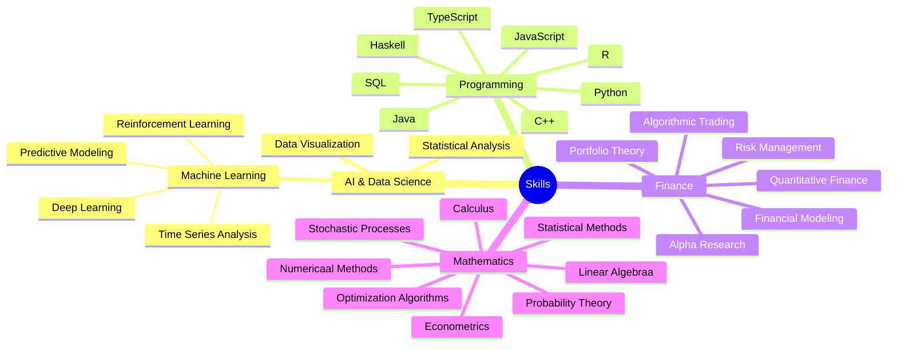
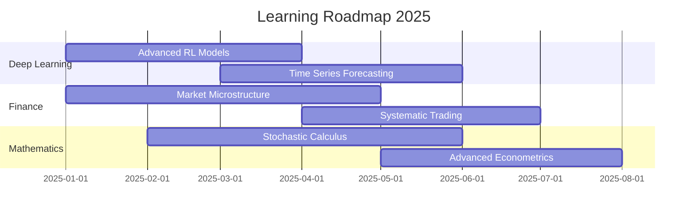

    
    

  

 

  <table>
    <tr>
      <td>
        
      </td>
      <td>
        
      </td>
    </tr>
  </table>

  <table>
    <tr>
      <td align="center" width="96">
        
         Python
      </td>
      <td align="center" width="96">
        
         NumPy
      </td>
      <td align="center" width="96">
        
         Pandas
      </td>
      <td align="center" width="96">
        
         TensorFlow
      </td>
      <td align="center" width="96">
        
         PyTorch
      </td>
      <td align="center" width="96">
        
         MySQL
      </td>
      <td align="center" width="96">
        
         R
      </td>
      <td align="center" width="96">
        
         GraphQL
      </td>
      <td align="center" width="96">
        
         Raspberry Pi
      </td>
    </tr>
    <tr>
      <td align="center" width="96">
        
         Java
      </td>
      <td align="center" width="96">
        
         C++
      </td>
      <td align="center" width="96">
        
         C#
      </td>
      <td align="center" width="96">
        
         JavaScript
      </td>
      <td align="center" width="96">
        
         TypeScript
      </td>
      <td align="center" width="96">
        
         ReScript
      </td>
      <td align="center" width="96">
        
         Sass
      </td>
      <td align="center" width="96">
        
         AWS
      </td>
      <td align="center" width="96">
        
         Docker
      </td>
    </tr>
  </table>

  

  
  

 

  

  

