'

<!-- Profile Loading -->

```bash
> Loading...
> Initializing profile...
> Role: Quantitative Researcher | HealthTech Innovator | Tech-Economist
> Interests: FinTech · Complex Systems · DeFi · AI & Data Science
> Status: Always building. Always learning.
> Profile Load Completed⭐
```
<!-- Stats and Links Badges -->

<div align="center">
    <a href="https://github.com/niraj-k-fin/niraj-k-fin"></a>
    <a href="https://github.com/python/cpython"></a>
    <a href="https://github.com/niraj-k-fin/niraj-k-fin/graphs/contributors"></a>
    <a href="https://github.com/niraj-k-fin/niraj-k-fin/stargazers"></a>
    <a href="https://github.com/niraj-k-fin/niraj-k-fin/network/members"></a>
    
    <a href="https://github.com/niraj-k-fin"></a>
    <a href="https://github.com/niraj-k-fin"></a>
    <a href="https://www.google.co.in/maps/place/K.V.+Samana/@22.1276401,70.1620009,808m/data=!3m2!1e3!4b1!4m6!3m5!1s0x39579df40faedbed:0x2420b015f99de6e8!8m2!3d22.1276352!4d70.1645758!16s%2Fg%2F11cnc20k9r?entry=ttu&g_ep=EgoyMDI1MDQzMC4xIKXMDSoASAFQAw%3D%3D">
    
  <a href="https://www.google.co.in/maps/place/Lovely+Professional+University/@31.2553967,75.7022929,746m/data=!3m2!1e3!4b1!4m6!3m5!1s0x391a5f5e9c489cf3:0x4049a5409d53c300!8m2!3d31.2553921!4d75.7048678!16s%2Fm%2F02wbfhd?entry=ttu&g_ep=EgoyMDI1MDQzMC4xIKXMDSoASAFQAw%3D%3D">
  
</a>
<a href="https://www.linkedin.com/in/nirajkofficial/" target="_blank">
  
</a>

<a href="https://wa.me/+919279337152" target="_blank">
  
</a>
<a href="https://www.instagram.com/nirajkumar_real/" target="_blank">
  
</a>

</div>

<!-- My ASCII Profile -->

<div align="centre">
  
</div>

<br>

<!-- GitHub Stats -->

<div align="center">
  <table>
    <tr>
      <td>
        <a href="javascript:void(0);">
          
        </a>
      </td>
      <td>
        <a href="javascript:void(0);">
            </img>
        </a>
      </td>
    </tr>
  </table>
</div>

<h2> ⚡ From Code to Cosmos : My Visionary Journey Through Data and Innovation 🌠 </h2>



<!-- Skills and Domains Charting -->

```mermaid
graph LR
    A[🎓 Aug' 2023<br>Started CSE @ LPU] --> B[🌍 2024<br>Campus Ambassador<br>Teach For India]
    B --> C[🧠 2025<br>Silver Contributor<br>WorldQuant BRAIN]
    C --> D[💹 2025<br>Quant Strategy Builder<br>HealthTech ML Developer]
    D --> E[🚀 2026<br>Scaling AI in<br>Finance & Healthcare]
    E --> F[🔮 2027<br>DeFi & BioAI Innovator<br>Global Impact]
```

| Skill                | Level           | Progress              | Years of Exp | Used In Projects | Improving? | Last Updated  |
|---------------------|-----------------|------------------------|--------------|------------------|------------|---------------|
| 🐍 Python           | Mastery         | ▓▓▓▓▓▓▓▓▓░ 90%        | 3+ yrs       | ✅               | 🔁 Yes     | April 2025    |
| 📉 Quant Finance    | Advanced        | ▓▓▓▓▓▓▓▓░░ 85%        | 2 yrs        | ✅               | ✅ Absolutely | May 2025   |
| 🤖 Machine Learning | Intermediate    | ▓▓▓▓▓▓▓░░░ 70%        | 1.5 yrs      | ✅               | 🔁 Yes     | March 2025    |
| 💊 HealthTech AI    | In Progress     | ▓▓▓▓▓░░░░░ 50%        | < 1 yr       | ✅               | ✅ Yes     | May 2025      |
| 📈 Statistics       | Solid           | ▓▓▓▓▓▓▓▓░░ 80%        | 2 yrs        | ✅               | 🔁 Yes     | April 2025    |
| 🧠 Problem Solving  | 🔥 Always Leveling | ▓▓▓▓▓▓▓▓▓▓ 100%     | Lifelong     | ✅               | 🔁 Always  | Ongoing       |


<!-- My Tech Stack -->
<div align="center">
  <table>
    <tr>
      <td align="center" width="96">
        
        <br>Python
      </td>
      <td align="center" width="96">
        
        <br>NumPy
      </td>
      <td align="center" width="96">
        
        <br>Pandas
      </td>
      <td align="center" width="96">
        
        <br>TensorFlow
      </td>
      <td align="center" width="96">
        
        <br>PyTorch
      </td>
      <td align="center" width="96">
        
        <br>MySQL
      </td>
      <td align="center" width="96">
        
        <br>R
      </td>
      <td align="center" width="96">
        
        <br>GraphQL
      </td>
      <td align="center" width="96">
        
        <br>Raspberry Pi
      </td>
    </tr>
    <tr>
      <td align="center" width="96">
        
        <br>Java
      </td>
      <td align="center" width="96">
        
        <br>C++
      </td>
      <td align="center" width="96">
        
        <br>C#
      </td>
      <td align="center" width="96">
        
        <br>JavaScript
      </td>
      <td align="center" width="96">
        
        <br>TypeScript
      </td>
      <td align="center" width="96">
        
        <br>ReScript
      </td>
      <td align="center" width="96">
        
        <br>Sass
      </td>
      <td align="center" width="96">
        
        <br>AWS
      </td>
      <td align="center" width="96">
        
        <br>Docker
      </td>
    </tr>
  </table>
</div>

<!-- Skills MindMap using Mermaid -->


<!-- Learning RoadMap using Mermaid -->


<!-- GitHuB Activity Graph -->

<div align="center">
  <a href="https://github.com/niraj-k-fin">
    
  </a>
</div>

<!-- Contact Me -->

<div align="center">
  <a href="https://www.linkedin.com/in/nirajkofficial" target="_blank">
    
  </a>
  <a href="mailto:nirajkumar.official.001@gmail.com">
    
  </a>
</div>

<!-- Random Quote Updates with Footer Animation -->

<div align="center">
  
</div>

```bash

 __  __           _                 _ _   _       _                   
|  \/  | __ _  __| | ___  __      _(_) |_| |__   | |    _____   _____ 
| |\/| |/ _` |/ _` |/ _ \ \ \ /\ / / | __| '_ \  | |   / _ \ \ / / _ \
| |  | | (_| | (_| |  __/  \ V  V /| | |_| | | | | |__| (_) \ V /  __/
|_|  |_|\__,_|\__,_|\___|   \_/\_/_|_|\__|_| |_| |_____\___/ \_/ \___|
| |__  _   _  | \ | (_)_ __ __ _ (_) | |/ /   _ _ __ ___   __ _ _ __  
| '_ \| | | | |  \| | | '__/ _` || | | ' / | | | '_ ` _ \ / _` | '__| 
| |_) | |_| | | |\  | | | | (_| || | | . \ |_| | | | | | | (_| | |    
|_.__/ \__, | |_| \_|_|_|  \__,_|/ | |_|\_\__,_|_| |_| |_|\__,_|_|    
 /\/|  |___/                   |__/ ____ _             _   _       _  
|/\/  | \ | | _____   _____ _ __   / ___(_)_   _____  | | | |_ __ | | 
      |  \| |/ _ \ \ / / _ \ '__| | |  _| \ \ / / _ \ | | | | '_ \| | 
      | |\  |  __/\ V /  __/ |    | |_| | |\ V /  __/ | |_| | |_) |_| 
      |_| \_|\___| \_/ \___|_|     \____|_| \_/ \___|  \___/| .__/(_) 
                                                            |_|       

```

<div align="center">
  
</div>
